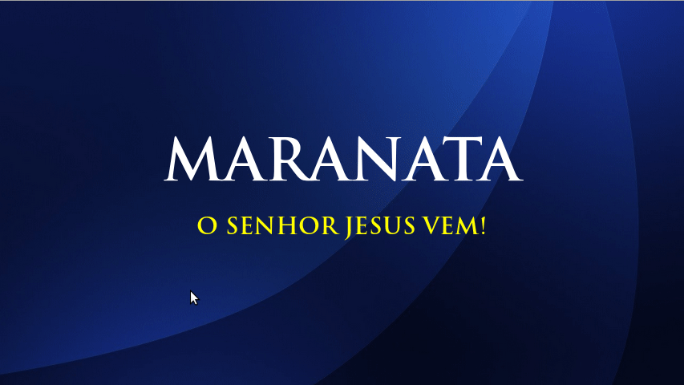

---
title:
layout: default
---

Projeção para Igreja Cristã Maranata. Suporta os idiomas português (pt-BR), inglês (en) e italiano (it)

Painel                     |  Projeção
:-------------------------:|:-------------------------:
      |  

Características
---------------

* Edição fácil de louvores (Uma linha vazia faz a separação dos slides)
* Criar pastas para organizar letras (em um idioma específico)
* Crie de forma rápida sua lista de projeção (apenas com um duplo-clique no louvor)
* Projeta avisos
* Projeta imagens
* Suporte a bíblias (ACF e NVI)
* Suporte a múltiplos idiomas

Tecnologias Utilizadas
----------------------

1. Bootstrap
2. Jstree
3. Reveal.js
4. jQuery
5. FontAwesome

Roda nos navegadores
--------------------

* Mozilla Firefox (funciona 100%)
* Google Chrome ( funciona com limitação: "necessário importar manualmente data.json" )
* Opera ( funciona com limitação: "necessário importar manualmente data.json" )

Uso
---

1. Execute **index.html**
2. **Permitir pop-up** (aviso no canto superior direto do navegador)
3. Feche o navegador e execute novamente **index.html**

obs: Se você não estiver usando o **Mozilla Firefox**, precisará abrir manualmente os dados / data.json
