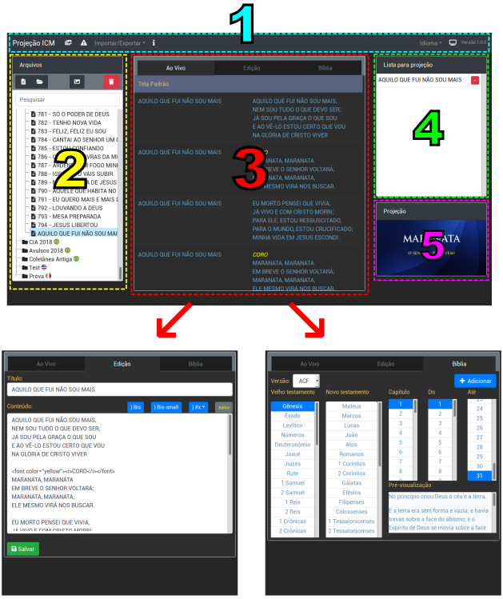

Manual do Usuário

 

 

 

<strong>Projeção ICM</strong>

 

 

 

 

 

Ítalo Carvalho Zaina

## 1. Visão geral

O novo painel possui 5 áreas principais para controlar a projeção como mostrado na imagem acima.

1. __Menu__: No menu superior é possível ver a versão atual, mudar o idioma, importar ou exportar os arquivos de louvores, criar avisos e trocar a imagem de fundo da projeção.
2. __Arquivos__: Nesta área lateral ficam todos os louvores separados por pastas, assim como imagens e avisos que podem ser adicionados a lista para projeção. Há botões para inserir novos louvores, pastas, imagens com também a possibilidade de excluí-los. Possui também uma pesquisa dinâmica, que procura pelo titulo ou conteúdo do louvor.
3. __Abas__: Está área central possui 3 abas distintas (_Ao Vivo_, _Edição_ e _Bíblia_).
  * __Ao Vivo__: Aba responsável por controlar o que será exibido na tela de projeção, com apenas um clique sobre suas linhas será projetado, também é possível utilizar-se das setas do teclado para mudar de linha.
  * __Edição__: Nesta aba é possível editar um louvor previamente selecionado na lista de arquivos.
  * __Bíblia__: Aqui é possível selecionar livro, capítulo e versículos da bíblia e adiciona-los a _Aba Ao Vivo_ para projetar.
4. __Lista para projeção__: Nesta lista à direita ficam todos os _louvores, versículos, imagens e avisos_ adicionados para serem projetados também podem ser apagados ou re-adicionados livremente.
5. __Projeção__: Este quadro mostra uma miniatura do que esta atualmente projetado.

## 2. Utilização do painel

Ao iniciar o novo painel deve primeiramente se familiarizar com sua rotina de utilização, que é: 

1. Montar sua lista de projeção para o culto.
2. Projetar os louvores de sua lista.

À seguir verá as instruções básicas de como proceder para realizar esta rotina.

### Montar sua lista para projeção

Com apenas __um duplo clique__ sobre o arquivo do louvor ele será adicionado a lista de projeção, se desejar removê-lo deve clicar no botão ( - ) ao lado do louvor em sua lista.

### Projetar um louvor

Muito simples é projetar um louvor com o novo painel, na aba __Ao Vivo__, dê __um clique__ sobre a estrofe que deseja projetar. Ou como alternativa __um clique__ sobre o louvor que esta em sua lista de projeção.

Depois de iniciado a projeção poderá controlar a lista __Ao Vivo__ usando o teclado:

* [ ↓ ] ou [ → ] para avançar
* [ ↑ ] ou [ ← ] para retroceder
* [ ESC ] atalho para tela padrão

#### Adicionar ou editar um louvor

[TOC]

